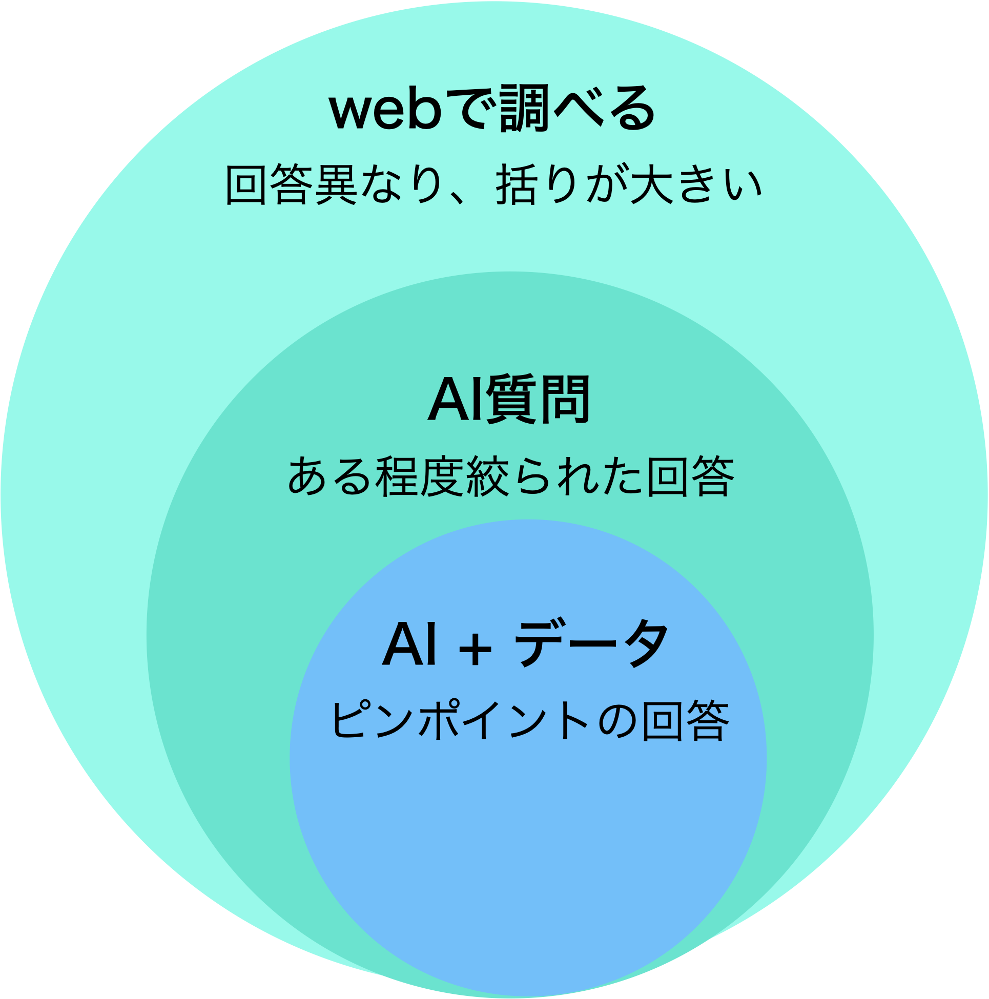

# はじめに
- このファイルでは、アプリを動作させるための環境構築手順を記載する

# 動作環境構築方法
### 前提
pythonかインストールしていること

### 手順
1. 仮想環境の構築
   1. 環境作成
  ```
   python3 -m venv venv
  ```

[環境構築手順](https://qiita.com/hogarakaryo/items/7a343e5075a95046bf99)
2. DBの各種テーブル登録方法
3. 
### djangoの基礎を学習・アウトプットできる
記録アプリという特性上、以下内容を学習できる
- MVT構造やORM等
- データ設計力
- アプリ関連系
### 題目が身近である
- 必要な機能を整理しやすい
- 拡張を行う際の課題が明確
### 身近な悩みがあった
- 子供の悩みごとを調べる機会が多かった。<br>
  →しかし、webで調べる場合は回答がweb記事によって異なる。もしくは大きな括りとして回答となる。<br>
    →なぜなら起きてる事象が子どもの状態によって様々であるため。
- ではAIに質問すれば良いのでは？<br>
  →質問に対する前提情報が少ない。<br>
    →webよりはある程度回答が絞れるが括りとしては大きい。
-  aiに事前データを上げれば良いのでは。。。
## 子ども相談 × AI × データ
aiにコンテキストを付与してあげればユーザーごとに同様の質問でも異なったピンポイントの回答が得れるのでは？<br><br>


# アプリ構成
## 機能概要
- ユーザー選択画面
  - ユーザーの追加、ログイン画面
- 子ども選択画面
  - 子どもの追加、選択、削除を行う
  - 追加時は名前、生年月日、写真を選ぶ
- 成長記録画面
  - メインダッシュボード画面
  - 身長・体重入力欄
    - 身長・体重・入力日を記載の上、追加ボタンにてDB登録
  - 日記入力欄
    - 入力日時・内容を記載の上、登録ボタンにてDB登録
    - 過去の日記を見るボタンにて過去日記一覧画面へ遷移
    - 詳細については機能詳細を参照
  - 乳児記録欄
    - カテゴリー選択にて記録種別を選択
    - 種別に応じた記録を入力の上、追加ボタンにてDB登録
    - 今日の詳細タイムラインを見るボタンにて乳児記録の当日タイムライン画面へ遷移
    - 詳細については機能詳細を参照
  - 乳児平均記録欄
    - カテゴリーに応じた平均値を当日、週、月にて記載
    - 詳細については機能詳細を参照
  - AI質問欄
    - 文章記載の上、質問ボタンにてAIチャットを行う
    - ボタン押下後はAI Chat画面に遷移
    - 詳細については機能詳細を参照
  - 身長と体重の推移欄
    - 表題の通り
    - 詳細については機能詳細を参照
  - 写真欄
    - 表題の通
- 過去日記一覧画面
  - 過去の日記を確認できる
  - 追加・編集・削除を行える
  - 詳細については機能詳細を参照
- 乳児記録の当日タイムライン画面
  - 表題の通り
- AI Chat画面
  - 遷移時は質問に沿った回答を出力
  - 以後会話を実施できる
  - 詳細については機能詳細を参照


## 機能詳細
### 日記
日記内容(noteカラム)を登録する際に要約(summaryカラム)内容を作成する機能を実装
#### 要約の作成理由
- 一覧表示した際に、一目で簡潔に分かりやすくするため
  - 過去日記一覧画面にて要約 + 内容として実装
- 将来的に要約をAI Chatのコンテキストに反映させ、より洗礼された回答を得るため
#### 要約の作成方法
1. ユーザーが入力した日記内容を取得
2. 以下事前プロンプトを用意しておき、プロンプト内に入力内容を反映(diary_summarizer関数)
   1. prompt = f"次の赤ちゃん日記を10字以内で簡潔に要約してください：\n{note_text}"
3. geminiAPIにてプロンプトをリクエストしてレスポンスを受け取る
4. noteと共にsummaryをDB登録

### 乳児記録・身長体重推移
乳児記録は記録項目が多い(milk摂取量や睡眠時間、トイレ等々)
そのため、各種項目をごとにテーブルを実装
#### なぜテーブルを分けたのか
- 1テーブルで項目カラムを設けるデメリット
  - 1テーブルの場合、各種記録項目の特性ごとにカラムが増えてしまう→noneになるレコードが増える
  - また、後々項目を追加しづらい
- 複数テーブルのメリット
  - 項目を増やしやすく応用が効く
  - djangoにてmodelやformを使う特性上、実装が容易
#### 平均記録について
- 一目で状況をわかりやすく、過去と比較しやすくするため
- またAIのコンテキストとして利用するため
- 各テーブル履歴よりリクエスト内容に基づいた平均データの算出(record_list関数)

### AI質問
質問を入力した際にコンテキストを入れてプロンプトを作成し、AIに質問するよう実装
#### コンテキスト実装理由
- なぜ「子ども成長アプリか」でも触れたが、ユーザーに沿った質問の回答を得るため
#### AI chat実装方法
1. ユーザーが入力した質問を取得
2. 乳児記録の直近1週間平均データを取得(record_list関数)
3. 以下プロンプトに各種項目を当てはめる(build_analysis_prompt関数)
```
下記育児データは直近{{period}}の平均値です：

# 育児データ
{{childcare_summary_lines}}

育児データを踏まえて、次の質問に対して
専門家として助言・分析してください。

質問：{{user_prompt}}
```
4. geminiAPIにてプロンプトをリクエストしてレスポンスを受け取る
5. AI Chat画面に遷移及び質問と回答を表示
6. 以降会話では上記プロンプトは使用せず過去質問 + 過去回答とともに新規質問をgeminiAPIへリクエストする<br>
   （意外と重要） 


## ディレクトリ構成
```
kidlog_project/
├── accounts/                          # ユーザー認証(ログインや登録)
│
├── ai_chat/                           # AIChat機能
│   ├── views.py                      # view定義（chat_page）
│   ├── urls.py                       # ai_chatアプリ内のURLパス設定
│   ├── utils/
│       └── summarizer.py/            # プロンプト作成（build_analysis_prompt, load_prompt_template）
│
├── child_select/                      # 子ども関連機能
│   ├── models.py                     # データベース定義（Child）
│   ├── forms.py                      # フォーム定義（ChildForm）
│   ├── views.py                      # view定義（child_selection_view、add_child_view等々）
│   ├── urls.py                       # chld_selectアプリ内のURLパス設定
│
├── data/                              # debug用子どもデータimportファイル一覧
│
├── diary/                             # 日記管理
│   ├── models.py                     # データベース定義（DiaryRecord）
│   ├── forms.py                      # フォーム定義（DiaryRecordForm）
│   ├── views.py                      # view定義（diary_list, diary_add等々）
│   ├── urls.py                       # diaryアプリ内のURLパス設定
│   ├── utils/
│       └── summarizer.py/            # プロンプト、AI要約取得（diary_summarizer）
│
├── kidlog/                            # メインアプリ（子ども成長記録機能全般）
│   ├── models.py                     # データベース定義（各Recordモデル）
│   ├── forms.py                      # フォーム定義（各RecordForm）
│   ├── views.py                      # ビュー定義（dashboard, baby_record_overview等々）
│   ├── urls.py                       # kidlogアプリ内のURLパス設定
│
├── kidlog_project/                    # プロジェクト設定フォルダ（settings.pyなど）
│   ├── settings.py                   # プロジェクト全体の設定（DB・静的ファイル・アプリ登録など）
│   ├── urls.py                       # ルートURL設定
│
├── manage.py
│ 
├── utils/                             # 汎用ファイルフォルダ（settings.pyなど）
│   ├── record_list.py                # 乳児記録一覧取得（childcare_record_list）
│   ├── gemini.py                     # Gemini接続（gemini_generate）
│ 
├── script/                            # debug用子どもデータ作成・importファイル一覧
│ 
├── static/                            # 静的ファイル（CSS・JS・画像）
│   ├── css/
│   │   ├── dashboard.css            # ダッシュボード用スタイル
│   └── js/
│        ├── ai_chat.js               # ai_chat用
│        ├── dashboard.js             # ダッシュボード用
│        ├── baby_record_add.js       # 子ども追加画面
│   │
├── templates/
│   └── ai_chat/
│       ├── ai_chat.html              # ai_chat画面
│   └── child_selection/
│       ├── add_child.html            # 子ども追加画面
│       ├── child_selection.html      # 子ども選択画面
│   └── diary/
│       ├── diary_edit.html           # 日記追加・編集画面
│       ├── diary_list.html           # 日記一覧画面
│   └── diary/
│       ├── diary_edit.html           # 日記追加・編集画面
│       ├── diary_list.html           # 日記一覧画面
│   └── kidlog/
│       ├── dashboard.html            # メインダッシュボード
│       ├── baby_record_add.html      # 乳児記録入力画面
│       ├── baby_record_overview.html # 乳児記録一覧画面
│   └── registration/
│       ├── login.html                # ユーザーログイン画面
│       ├── signup.html               # ユーザー登録画面
│   └── base.html
└── media/
    └── child_photos/                  # 子どものプロフィール写真がアップロードされる場所
└── env                                # 環境変数
└── record_import.sh                   # debug用子どもデータ一括import用
└── requirements.txt                   # 環境構築ファイル
```
